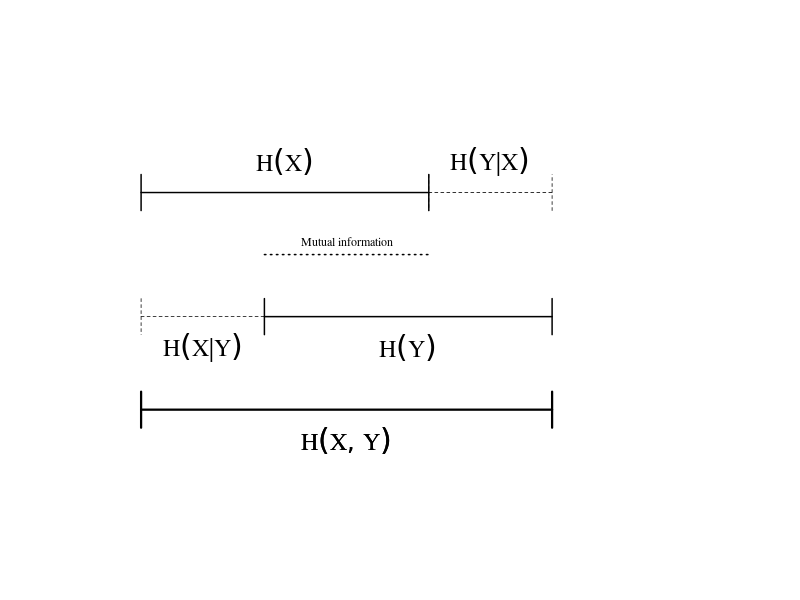

```{r, include = FALSE, message =FALSE, warning=FALSE}
library(learnr)
library(humdrumR)
humdrumR(syntaxHighlight = FALSE, maxRecordsPerFile = 30L)
source('helper_functions.R')
tutorial_options(exercise.lines = 10)

```

```{r setup, include = FALSE}
library(humdrumR)
humdrumR(syntaxHighlight = FALSE, maxRecordsPerFile = 30L)
load('../Data/Bach370/Bach.Rd')
load('../Data/CoCoPops/CoCoPops.Rd')
load('../Data/Saraga/Saraga.Rd')

options(width = 200)
```

<script language="JavaScript" src="js/scripts.js"></script>

## Intro

In this tutorial, we explore different representations of pitch *information*, including both theoretical/conceptual definitions and quantitative definitions based in information theory.
Throughout, we will use humdrum$_{\mathbb{R}}$ code to ground our discussion in empirical observation of real music data.


## Data

We'll use a few existing datasets:

+ The trusty 371 Bach Chorales^[Actually 370, because I'll leave out the one five-voice chorale.].
+ Vocal melodies from the [Coordinated Corpus of Popular music](https://github.com/Computational-Cognitive-Musicology-Lab/CoCoPops).
+ F0 contours from [Saraga](https://mtg.github.io/saraga/) (Carnatic music)

We can read these datasets into R using humdrum$_{\mathbb{R}}$:

```{r,  message = FALSE, eval = FALSE}
library(humdrumR)

bach <- readHumdrum('../Data/Bach370/.*krn')
cocopops <- readHumdrum('../Data/CoCoPops/.*hum')
saraga <- readHumdrum('../Data/Saraga/.*freq') |> 
  cleave(1:2) |>
  within(Timestamp = as.numeric(Token), F0 = as.numeric(Spine2))


```


###

> We can inspect files from each dataset.

```{r inspect, eval = FALSE, echo = TRUE}
bach[10] # view 10th chorales

cocopops[100] # view 100th cocopops song

census(bach)

```

> Try it out:

```{r data, exercise = TRUE}

```


## Representing Pitch Information

In Western music theory and practice, we have a number of ways of representing the "pitch" of note events.

+ Frequency
+ Cents
+ Semitones
+ Chroma
+ Pitch classes
+ Steps (generic)
+ Tonal name (specific)
+ Scale degrees
+ Intervals
+ Etc.

### 

Our three datasets represent radically different sources of pitch information:

+ *Bach Chorales*: 
  + Explicitly notated scores. 
  + Pre-EQT gamut.
+ *CoCoPops*: 
  + By-ear transcriptions of recordings. 
  + Modern EQT gamut but includes blues-inflected music.
+ *Saraga*: 
  + Machine extraction of continuous [$F_0$](https://en.wikipedia.org/wiki/Fundamental_frequency) contours.
  + No absolute gamut (non-Western scale).


### Dimensions {.tabset data-progressive=TRUE}

Different pitch representations encode different aspects/dimensions of the construct "pitch."

#### Acoustic vs Perceptual

```{r, echo = FALSE, out.width = 600, out.height=600, fig.height=5, fig.width = 5}
pitch_space1("Acoustic", "Perceptual")

lab(0, 'Frequency')
lab(0.2, "Cents")
lab(.5, 'Semitones')
lab(1, "Scale degrees")
lab(.8, "Intervals")

```

#### Atonal vs Tonal

```{r, echo = FALSE, out.width = 600, out.height=600, fig.height=5, fig.width = 5}
pitch_space1("Atonal", "Tonal")

lab(0, "Frequency\nCents")
lab(.2, 'Semitones')
lab(.7 , 'Scientific pitch')
lab(1, "Scale degree")
lab(.85, 'Intervals')

```

#### Absolute vs Relative


```{r, echo = FALSE, out.width = 600, out.height=600, fig.height=5, fig.width = 5}
pitch_space1("Absolute", "Relative")

lab(0, 'Frequency')
lab(0.2, 'Semitones')
lab(0.3, 'Scientific pitch')
lab(.8, 'Scale degree')
lab(1, 'Intervals')

```


### Humdrum {.tabset}

#### Construct

Humdrum representations for all of these things are defined:

```{r, echo = FALSE, out.width = 600, out.height=600, fig.height=5, fig.width = 5}

pitch_space2('Atonal', 'Tonal', 'Absolute', 'Relative')

lab2(0, 0, 'Frequency')
lab2(0.2, 0.2, 'Semitones')
lab2(.8, .3, 'Scientific pitch')
lab2(1, .8, 'Scale degree')
lab2(1,1,'Intervals')

```

#### Humdrum

Humdrum representations for all of these things are defined:

```{r, echo = FALSE, out.width = 600, out.height=600, fig.height=5, fig.width = 5}

pitch_space2('Atonal', 'Tonal', 'Absolute', 'Relative')

lab2(0, 0, '**freq')
lab2(0.2, 0.2, '**semits')
lab2(.8, .3, '**pitch\n**kern')
lab2(1, .8, '**deg\n**solfa')
lab2(1, 1, '**mint\n**hint')

```

#### HumdrumR

Humdrum$_{\mathcal{R}}$ can read/write most common representations.

```{r, echo = FALSE, out.width = 600, out.height=600, fig.height=5, fig.width = 5}


pitch_space2('Atonal', 'Tonal', 'Absolute', 'Relative')

lab2(0, 0, 'freq()', family = 'mono')
lab2(0.2, 0.2, 'semits()', family = 'mono')
lab2(.8, .3, 'pitch()\nkern()', family = 'mono')
lab2(1, .8, 'deg()\nsolfa()', family = 'mono')
lab2(1,1,'interval()\nmint()', family = 'mono')


```

Use these functions to convert between different representations of pitch in R.

+ We can also use their `generic`/`specific` and `simple`/`complex` arguments to refine our representations.

###

> Try it out:

```{r pitchtransforms, exercise= TRUE}
bach[1] |> solfa()

```

```{r pitchtransforms-hint-1}
bach[1] |> freq()
bach[1] |> semits()
bach[10] |> deg()
bach[10] |> solfa(simple = TRUE)
```

```{r pitchtransforms-hint-2}

bach[1] |> mint()
bach[1] |> mint(classify = TRUE)

cocopops |> mint(deparser = semits)

```

### Explore


> **Which pitch translations are lossy and which lossless?**

```{r pitchexplore, exercise = TRUE}


```

```{r pitchexplore-solution}
sciPitch <- c('C4', 'E4', 'G#4', 'B4', 'C#5', 'D5')

sciPitch |> solfa() |> pitch() # lossless

sciPitch |> semits() |> pitch() # lossy

```

If a conversion is lossless, you should be able to convert from X to Y, then convert back from Y to X, and get the original X.

$$
f(g(x)) = x
$$


----

Some information is encoded directly in score data.
Other information can only be inferred/understood from data: our *domain knowledge*.

> **What information is actually embedded in the data tokens, and what is external knowledge?**
  
  
```{r domain, exercise = TRUE}


```

```{r domain-hint-1}
bach |> freq(frequency.reference = 420)

```


```{r domain-hint-2}
bach |> deg(Key = 'C:')

```


###

+ Absolute pitch height can only be inferred from scores if we have domain knowledge of the tuning system.
  + Conversely, tonal pitch categories can only be inferred from F0 data if we know the tuning system. 
+ Scale degrees can only be converted to absolute pitches if we know the key.
  + Scale-degree data may or may not encode octave as well.
  


> **What is the lowest fundamental frequency in the Bach chorales?**

```{r choralefreq, exercise = TRUE}


```

```{r choralefreq-solution}
# Trick question! It depends on the tuning system we assume.

# IF we assume 440 EQT

bach |> freq() |> pull() |> min()

# What about meantone temperament?

meantone5th <- 3 / ((81/80)^(1/4))

bach |> freq(frequency.reference = 420, tonalHarmonic = meantone5th) |> pull() |> min()


```


### Counting stuff

One of the best ways to learn about data is by inspecting the distribution of datapoints.
Try using the humdrum$_{\mathbb{R}}$ `count()` function, with different pitch representations.
The `pdist()` function is the same, except printing probabilities (proportions).

```{r echo = TRUE, eval = FALSE}

bach |> solfa() |> count()

cocopops |> solfa() |> count()

```

> **Do chorales or pop/rock use b7 more often?**

```{r solfa_compare, exercise = TRUE}

```

```{r solfa_compare-hint-1}
bach |> deg(simple = TRUE) |> count()

```

```{r solfa_compare-hint-2}
bach |> deg(simple = TRUE) |> pdist()
cocopops |> deg(simple = TRUE) |> pdist()
```


### Challenge

> **Which SATB voice type, in the Bach chorales, is most common in the CoCoPops vocals?**

```{r voice_type, exercise = TRUE}


```


```{r voice_type-solution}
bach |> 
  semits() |> 
  group_by(Spine) |>
  summarize(MeanPitch = mean(.)) -> means

cocopops |> semits() |> pull() -> popsemits

mean((popsemits - means$MeanPitch[1])^2) # bass
mean((popsemits - means$MeanPitch[2])^2) # tenor
mean((popsemits - means$MeanPitch[3])^2) # alto
mean((popsemits - means$MeanPitch[4])^2) # soprano

```


## Quantifying Pitch Information

The field of [information theory](https://en.wikipedia.org/wiki/Information_theory) explores ways of quantifying the "information content" of data.

The fundamental information-theory metric is [entropy](https://en.wikipedia.org/wiki/Entropy_(information_theory)), also called "Shannon entropy"^[After Claude Shannon.] or "information entropy."
Entropy is a useful way of characterizing the amount of information in a distribution.

###

Entropy is essentially the average (log) probability of observations. 

$$
H(X) := -\sum(P(X)\log_2(P(X))
$$

$$
H(X) := mean(-{\log_2 P(X)})
$$

I will use base-2 logarithms throughout; the units of base-2 entropy are called "bits."

###

What's the connection between probability and "information"?

+ High probability events are predictable, and thus *uninformative*.
+ Low probability events are unpredictable (even surprising), and thus relatively *informative*.


If a distribution is totally predictable the entropy is 0.
The more a distribution is made up of low-probability events, the higher the entropy.
Higher entropy means "more information per observation."

###


Entropy is useful because it is essentially a measure of how "flat" *any* distribution is:
Compare these two distributions:

| Rock | Reggae | Blues | Pop | Country | Jazz | Film | Classical | Metal | Punk | Funk | R&B | Folk |
|------|--------|-------|-----|---------|------|------|-----------|-------|------|------|-----|------|
| .14  | .04    | .09   | .15 | .13     | .08  | .03  | .03       | .04   | .07  | .05  | .08 | .06  |
| .12  | .02    | .02   | .67 | .06     | .01  | .01  | .01       | .01   | .01  | .01  | .01 | .02  |

```{r entropy_genre, echo = FALSE}

par(family = 'Times', mar = c(5,4,2,2), mfcol = c(1,2))
row1 <- c(.14,.04,.09,.15,.13,.08,.03,.03,.04,.07,.05,.08,.06)
row2 <- c(.12,.02,.02,.67,.06,.01,.01,.01,.01,.01,.01,.01,.02)
genres <- c("Rock","Reggae","Blues","Pop","Country","Jazz","Film","Classical","Metal","Punk","Funk","R&B","Folk")
x <- barplot(row1, main = 'Genre Distribution (Row 1)', axes =FALSE, ylim = c(0,1), space = 0)
axis(2, pretty(c(0, 1)), tick =FALSE, las = 1)
axis(1, x, genres, las = 2, tick = FALSE)

text(mean(x), .8, paste0('Entropy (bits) = ', round(-sum(row1 * log(row1, 2)), 2)))


x <- barplot(row2, main = 'Genre Distribution (Row 2)', axes =FALSE, ylim = c(0,1), space = 0)
axis(2, pretty(c(0, 1)), tick =FALSE, las = 1)
axis(1, x, genres, las = 2, tick = FALSE)

text(mean(x), .8, paste0('Entropy (bits) = ', round(-sum(row2 * log(row2, 2)), 2)))

```

The right distribution has a lower entropy because it is much more concentrated on a few values (especially Pop).
When we observe samples from this distribution, more than half the time we observe Pop, so we aren't surprised much. 
We do occasionally get surprised by a rare draw of Folk or Blues, but only very rarely---most of the time, we see the commonplace Pop.
In contrast, when we draw from the left distribution, every observation is a bit if a surprise, so the entropy is higher.


###


The key thing is that entropy can be computed even when distributions differ in number of levels, or even if there are infinite levels (continuous variables).
For example, the following distribution, with only four categories, also has 1.8 bits of entropy:

| Rock | Reggae | Blues | Pop |
|:----:|:------:|:-----:|:---:|
| .46  | .24    | .2    | .1  |


And so does this distribution:

```{r, echo = FALSE}
par(mar= c(2,2,2,2), mfcol=c(1,1))
curve(dnorm(x, 0, 1.191604), -5, 5, axes = FALSE)
mtext('Value', 1, line = 3)
mtext('Density', 2, line = 3)
axis(1, seq(-5,5,.5), las = 1, tick = FALSE,
     cex.axis = .5)
axis(2, seq(0,.3, .05), tick = FALSE, las = 1)

```


This means that entropy, unlike other measures of "variation," is not dependent on a particular model of the data.

### humdrumR entropy

We can calculate the entropy of data using the humdrum$_{\mathbb{R}}$ `entropy()` command.
The best way to do this to pass a distribution (`count()`) to the `entropy()` command.

```{r, echo = TRUE, eval = FALSE}
bach |> kern(simple = TRUE) |> count() |> entropy()

```


> **Which pitch representations have the lowest entropy? And why?**

```{r entropy_represents, exercise = TRUE }


``` 

```{r entropy_represents-hint-1}
bach |> pitch() |> count() |> entropy()

bach |> solfa() |> count() |> entropy()


```

> **Which data set (Bach or CoCoPops) has higher pitch entropy?**

```{r entropy_corpora, exercise = TRUE}


```

```{r entropy_corpora-hint-1}
# It might depend on what pitch representation we choose

bach |> pitch() |> count() |> entropy()
cocopops |> pitch() |> count() |> entropy()


```

```{r entropy_corpora-hint-2}
# It might depend on what pitch representation we choose

bach |> semits() |> count() |> entropy()
cocopops |> semits() |> count() |> entropy()


```

```{r entropy_corpora-hint-3}

bach |> pitch(simple = TRUE) |> count() |> entropy()
cocopops |> pitch(simple = TRUE) |> count() |> entropy()


```

It all depends on what our view of pitch is!
There isn't "one" entropy of data.

### Joint entropy


If we have multiple variables to consider, we can calculate the total information they represent together: their *joint entropy*.
The joint entropy of $X$ and $Y$ is notated:

$$
H(X, Y)
$$

A cool property of entropy is that, **if two variables are independent**, their *joint entropy* is the sum of their independent entropies.
For example, the entropy of a coin flip is one bit; the entropy of two independent coin flips is two bits; etc.

$$
H(X, Y) = H(X) + H(Y)
$$


However, if two distributions are dependent, they share *mutual information*;
Gaining knowledge about one variable ($X$) also tells us information about the other $Y$.
Thus their actual joint entropy will be less than the sum of the independent entropies.

$$
H(X, Y) < H(X) + H(Y)
$$

### Conditional entropy

The conditional entropy is the entropy of the *conditional probability* of observations.
Notated:

$$
H(X | Y) 
$$


If knowledge about $X$ can be used to predict $Y$, then their is redundancy (shared information) between them.
Once we know $X$, the information left in $Y$ is reduced.
If two variables are dependent, their conditional entropy will be less than their marginal entropy.


$$
H(Y | X) = H(X, Y) - H(X)
$$


```{r, echo = FALSE, out.height = 400, out.width=600}


bar <- function(x, y, l, ...) {
  arrows(x, y, x+ l, y, code = 3, angle = 90, ...)
}

entropyplot <- function(x, y) {
  mi <- max((x + y) - 1, 0)
  
  plot.new()
  plot.window(c(0, x+y), c(0, 1))
  
  bar(0, .8, x, lwd = 2)
  text(x / 2, .9, quote(H(X)))
  
  bar(1, .4, -y, lwd = 2)
  text(1 - (y/2), .3, quote(H(Y)))
  
  bar(x, .8, (1 - x), lty = 'dashed')
  text(x + (1-x)/2, .9, quote(H(paste(Y, '|', X))))
  
  bar(0, .4, 1 - y, lty = 'dashed')
  text((1-y)*.5, .3, quote(H(paste(X, '|', Y))))
  
  if (mi > 0) {
  bar(1-y, .6, mi, lty = 'dotted', lwd = 2, length = 0)
  text(x - (mi/2), .58, pos = 3, 'Mutual information', cex = .5)
    text(.5, 0, quote(H(X, Y)))
  text(.5, 0, quote(H(X, Y)))
  } else {
    
    mtext('Variables are independent', 1, cex = 2)
    text(.5, 0, quote(H(X, Y) == H(X) + H(Y)), xpd = TRUE)
  }
  
  bar(0, .1, 1, lwd = 3)
  
}



```

### Joint/Conditonal entropy in humdrumR

In humdrum$_{\mathbb{R}}$, we can pass two (or more) variables to the `count()` function, then pass that to entropy.
We can also pass a `condition` argument to `entropy()`.

> Try it out:

```{r humdrumRcond, exercise = TRUE}
cocopops |> pitch() |> count(Pitch, Key) |> entropy()
cocopops |> pitch() |> count(Pitch, Key) |> entropy(condition= 'Key')
```


### Exercises

> **How do different representations of pitch "divide up" information?**

```{r pitchentropy, exercise= TRUE}

```


```{r pitchentropy-hint-1}
bach |> count(Key) |> entropy()

bach |> deg() |> count() |> entropy()
```

```{r pitchentropy-hint-2}
bach |> deg() |> count(Deg, Key) |> entropy()
bach |> deg() |> count(Deg, Key) |> entropy(condition = 'Key')
```

> **Is information content in the Chorales and CoCoPops similarly partitioned?**

```{r entropy_cocopopsvsbach, exercise = TRUE}


```

```{r entropy_cocopopsvsbach-solution}

bach |> deg() |> count() |> entropy()
bach |> count(Key) |> entropy()


cocopops |> deg() |> count() |> entropy()
cocopops |> count(Key) |> entropy()


```


### Challenge

> **How much mutual information is there between pitch and rhythm information?**

```{r mutualrhythm, exercise = TRUE}


```

```{r mutualrhythm-solution}
# It depends on what pitch representation we use!

bach |> 
  mutate(Mint = mint(Token), Duration = recip(Token)) -> bach

bach |> select(Mint) |> entropy() -> Hmint
bach |> select(Duration) |> entropy() -> Hdur

bach |> count(Mint, Duration) |> entropy() -> Hmintdur

(Hmint + Hdur) - Hmintdur
  

```


## Pitch Sequencing Information 

We've only been considering pitch events in isolation.
However, sequential pitch events are obviously not independent.

### Lag

We can explore this using the humdrumR$_{\mathbb{R}}$ lag feature.
The syntax looks like this:

```{r echo = TRUE, eval = FALSE}

bach |> pitch(simple = TRUE, generic = TRUE) |> count(Pitch, Pitch[lag = 1])

```

> Try it out:

```{r trylag, exercise = TRUE}

bach |> 
  pitch(simple = TRUE, generic = TRUE) |> 
  count(Pitch, Pitch[lag = 1])


```


### Exercises


> **How much information does each pitch convey, if you known the previous pitch?**

```{r antecedent, exercise= TRUE}


```


```{r antecedent-solution}
cocopops |> 
  deg(simple = TRUE) |>
  count(Deg, Deg[lag = 1]) |>
  entropy(condition = 2)

```


## Other Analyses

> **Can we use entropy to estimate the tuning of the Saraga data?**

```{r saraga, exercise = TRUE, warn = FALSE}
saraga |> 
  select(F0) |> 
  semits(Exclusive = 'freq',
         parseArgs = list(frequency.reference = 440)) |>
  entropy()


```


> **Is la-based minor more informative than do-based minor?**

```{r labased, exercise = TRUE}
bach |> 
  pitch(simple = TRUE, transposeArgs = list(to = ifelse(Key %~% '[A-G]', 'C:', 'a:'))) |>
  count() |> 
  entropy() 

```
